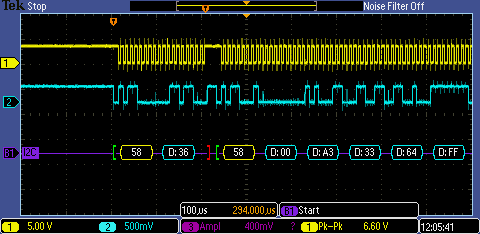

# fpga virtual graffiti

my first 'proper' FPGA project.

* with the icestick usb board
* icestorm free fpga tools.
* gtkwave for debugging.

# Integration notes

* wiimote camera on branch wii-pcb is working
* on branch sram-video-test, i2c data not seen to be working
* sometimes i2c clock line is not a square but very short pulses (maybe a problem with tristate?)
* tried clock enable on i2c (on separate branch), but slowed down timing estimate
* sometimes when video doesn't work, the syncs and blanks are twice as short as
 they should be...
* sram-video-test branch has commit that shows working sram video buffer

# Wiimote Camera

* (breakout board)[https://github.com/mattvenn/kicad/tree/master/wiimote-fpga)
* 25mhz supplied on clock pin
* reset high to run

# I2C reader / writer

Started off with this youtube series:https://www.youtube.com/watch?v=rWzB5hZlqBA
by Tom Briggs.

In Tom's design, the I2C clock is assigned to the state machine's !clk.

Writing and requesting data was easy, but reading the data was difficult to
synchronize the clock. I then tried 2 different approaches:

* separating the I2C clock and state machine clock to give more time for reading
 data (4 state machine clocks for 1 I2C clock)
* generating the clock within the state machine itself.

Option 2 proved much easier to write. I also found this [brief Q&A on reddit on
the same topic](https://m.reddit.com/r/FPGA/comments/4oltue/when_writing_communication_protocols_spi_i2c_etc/)

# DVI output

based on [Hamster's minimal DVI-D
VHDL](http://hamsterworks.co.nz/mediawiki/index.php/Minimal_DVI-D)
